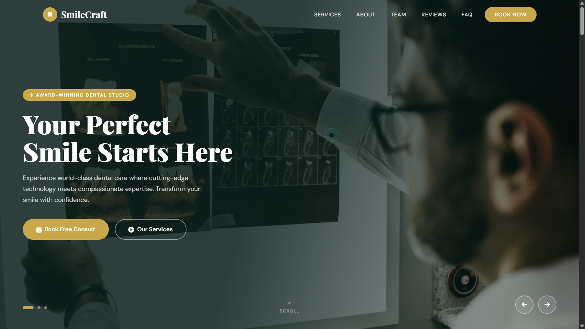
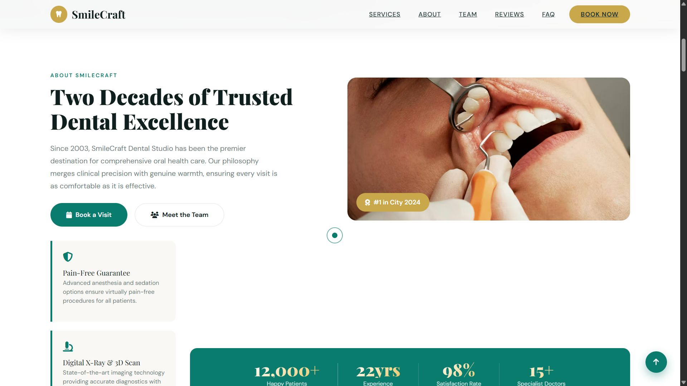
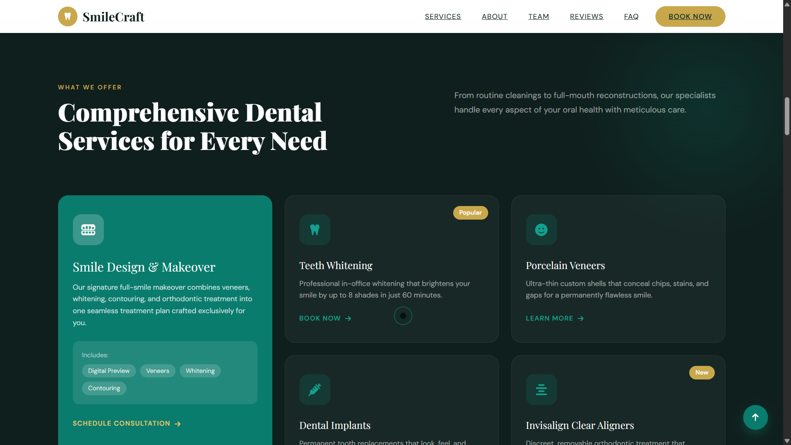
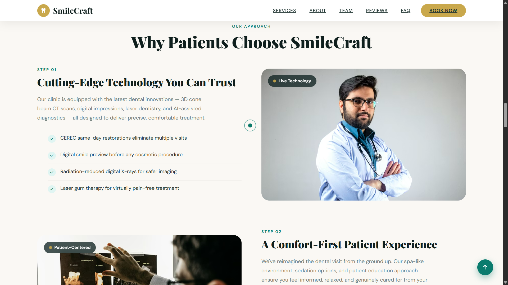
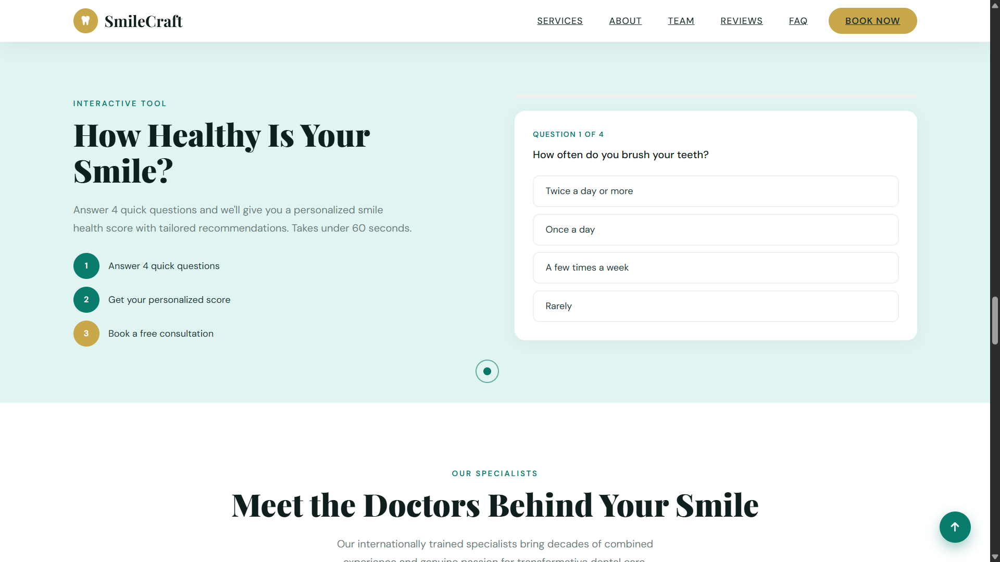
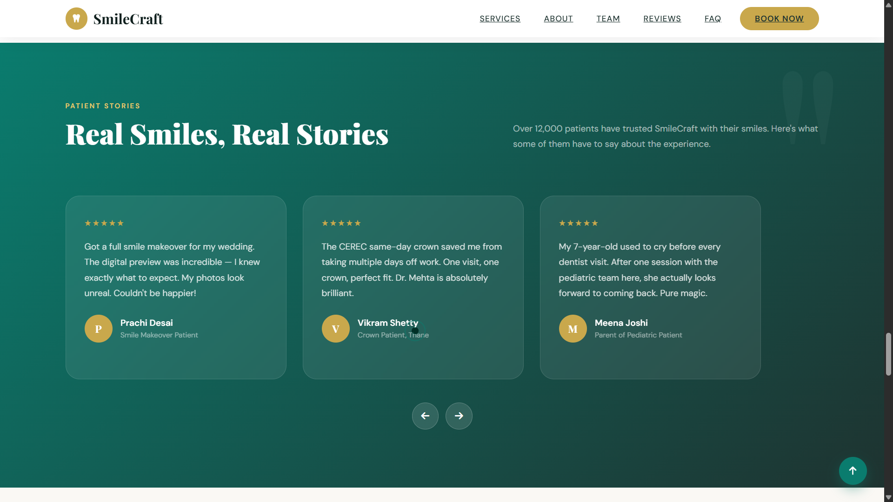
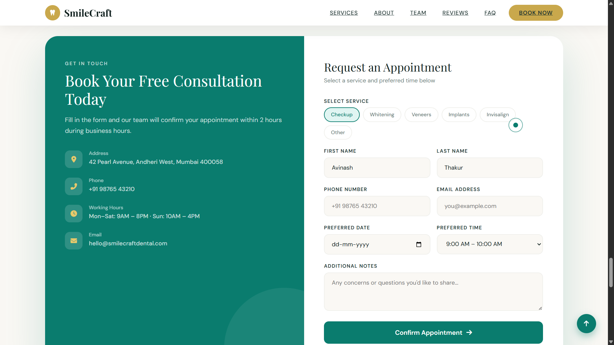
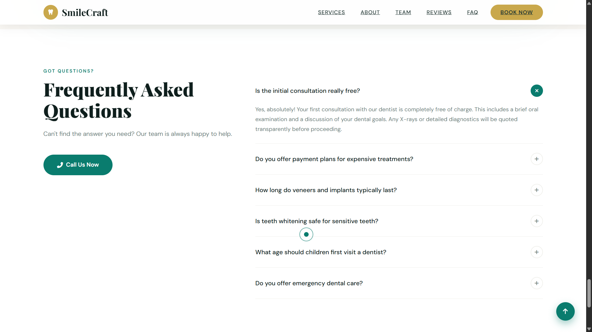
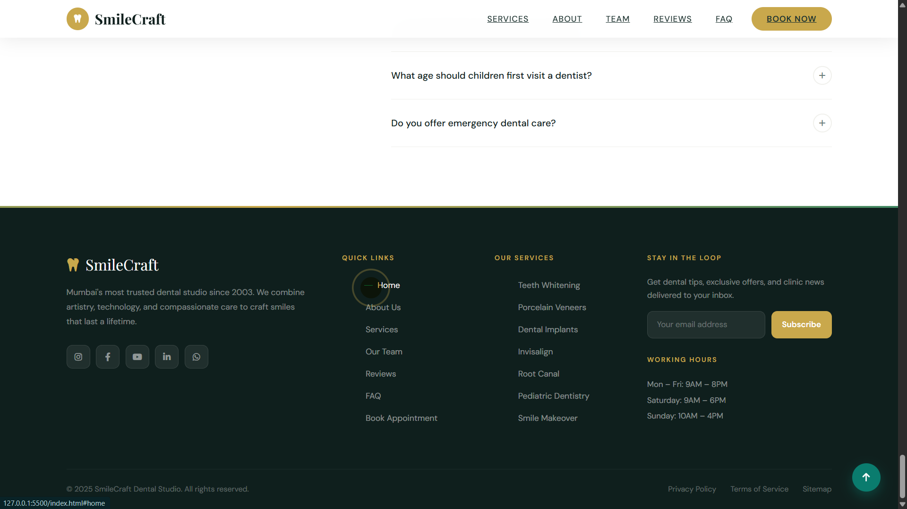

# Dentist Application

## Project Overview

The Dentist Application is a polished one-page frontend experience designed for a modern dental clinic. It showcases the user journey from first impression to appointment booking with strong visual hierarchy, trusted data displays, and interactive patient-focused elements.

## Key Sections and Interface Elements

### 1. Header & Starter Section

This hero section introduces the clinic with a welcoming header image, key call-to-action buttons, and a clear value proposition for new visitors. It sets the tone for the rest of the UI and invites patients to explore services and book appointments.

### 2. Analytics Overview

A business-focused analytics panel displays patient history metrics, total clients, and performance data. These cards help build trust by showcasing clinic growth, engagement statistics, and client volume at a glance.

### 3. Services Section

The services area highlights the clinic's core offerings with visually distinct service cards. It presents treatment categories, specialized care options, and patient benefits so visitors can easily understand what the clinic provides.

### 4. Why Choose Us Section

This section explains the clinic's unique advantages, including experience, quality care, and patient satisfaction. It reinforces trust through concise messaging and strong visual cues.

### 5. Quiz Section

An interactive quiz segment engages visitors and guides them through a simple self-assessment. This rare element adds a helpful diagnostic experience and encourages users to think about their dental needs before booking.

### 6. Specialists Details

Specialists are showcased with dedicated profile cards that include names, roles, and expertise. This builds credibility by highlighting the clinical team and their qualifications.

### 7. Patient Stories and Blogs

The testimonials and blog preview section shares patient stories, success cases, and informative articles. It reinforces credibility and keeps content engaging with social proof and educational material.

### 8. Request an Appointment Section

This booking section gives users a clear path to request an appointment. It includes a prominent form layout and persuasive messaging to convert visitors into scheduled patients.

### 9. FAQ Section

The FAQ segment answers common patient questions, reducing friction and building confidence. It provides a helpful resource for visitors who want quick answers before contacting the clinic.

## Professional Touches and Rare Elements

- Clean one-page navigation and clear user flow.
- Data-driven analytics cards for clinic performance and client history.
- A patient quiz feature for interactive pre-screening.
- Specialist profiles that emphasize team expertise.
- Testimonial and blog sections that enhance trust and SEO value.
- Appointment request form designed for conversion.

## How to Use This Repository

1. Open `index.html` in a browser to view the UI.
2. Review the section screenshots under `UI_images/` for visual reference.
3. Customize the service details, specialist profiles, and FAQ content for your clinic.

## Assets Included

- `index.html`
- `UI_images/1.png` through `UI_images/9.png`

---

Thank you for exploring this Dentist Application frontend. The layout is built to deliver a professional patient experience while clearly showcasing clinic strengths and services.